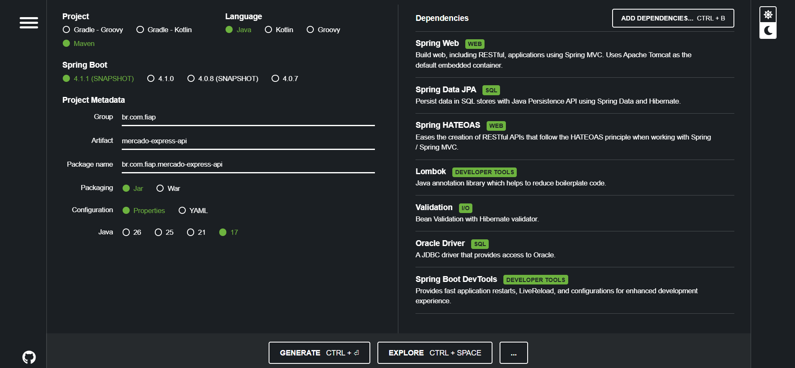
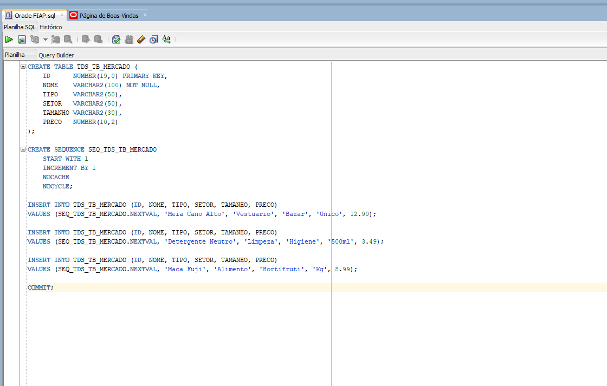
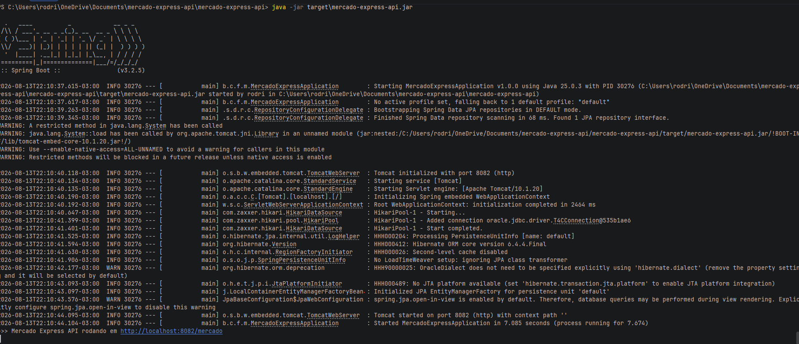
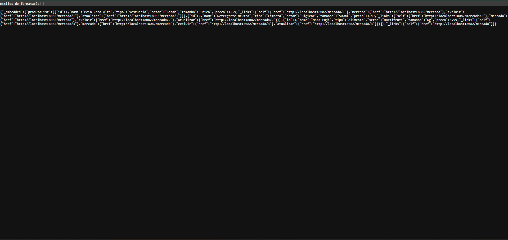
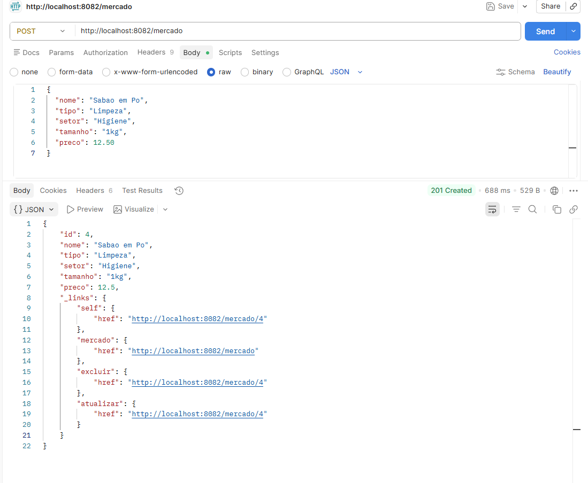
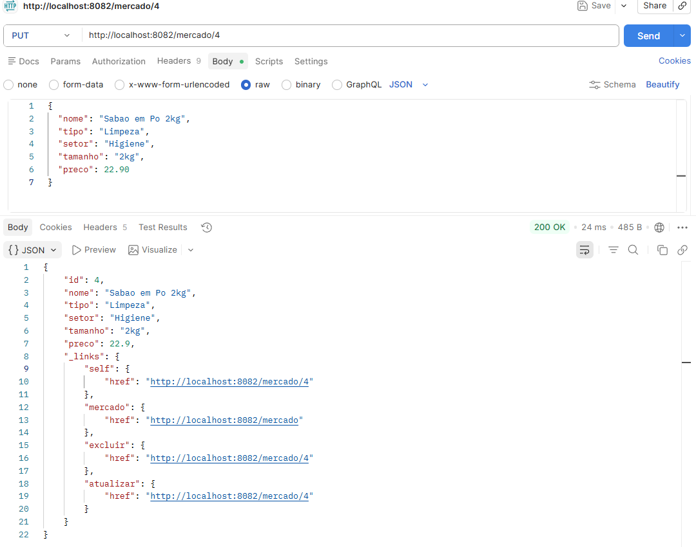
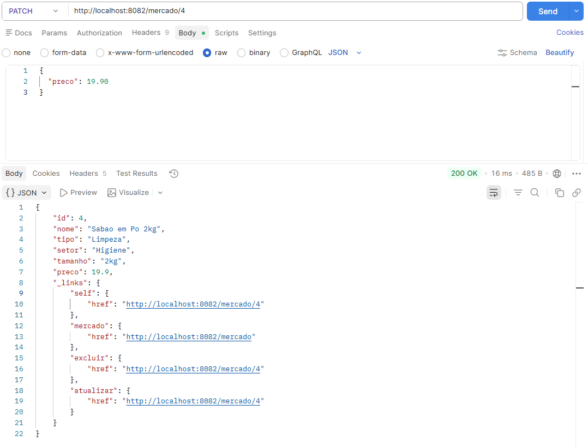
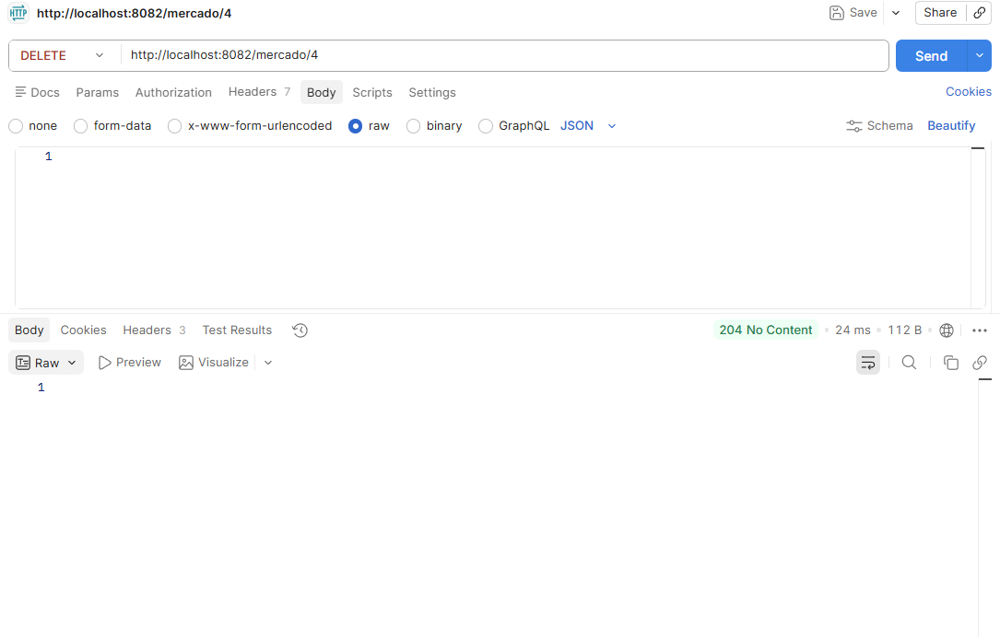

# Mercado Express API

Checkpoint 4 - Parte 1 (API e Deploy) - Tecnologia em Análise e Desenvolvimento de Sistemas (TDS) - FIAP
Professor: Dr. Marcel Stefan Wagner

API REST feita em **Spring Boot** para um mercado express (meias, produtos de limpeza, frutas, etc), com persistência no **Oracle (ORACLE_FIAP)** via JPA/Hibernate, **Lombok** e retorno no padrão **HATEOAS** (maturidade nível 3).

## Integrantes

| Nome | RM |
|---|---|
| Rodrigo Carvalho Silva | 565162 |
| Nickolas Davi | 564105 |
| Samara Vilela | 566133 |
| Natália Cristina | 564099 |
| Otávio Ferreira | 565960 |

IDE utilizada: **IntelliJ IDEA**

## Tecnologias

- Java 17
- Spring Boot 3.2.5 (Maven)
- Spring Web
- Spring Data JPA
- Spring HATEOAS
- Lombok
- Oracle Database (driver `ojdbc11`) - banco `ORACLE_FIAP`
- Bean Validation (`spring-boot-starter-validation`)

## Configuração do Spring Initializr

Projeto criado em [start.spring.io](https://start.spring.io) com:

- **Project:** Maven
- **Language:** Java
- **Spring Boot:** 3.2.5
- **Group:** br.com.fiap
- **Artifact / Name:** mercado-express-api
- **Packaging:** Jar
- **Java:** 17
- **Dependências:** Spring Web, Spring Data JPA, Spring HATEOAS, Lombok, Validation, Oracle Driver, Spring Boot DevTools



## Estrutura do projeto

```
mercado-express-api/
├── pom.xml
├── integrantes.txt
├── scripts/
│   └── create_table.sql        # cria TDS_TB_MERCADO + sequence no Oracle, caso o Hibernate nao tenha DDL
└── src/
    ├── main/
    │   ├── java/br/com/fiap/mercadoexpress/
    │   │   ├── MercadoExpressApplication.java
    │   │   ├── controller/
    │   │   │   ├── MercadoController.java        # endpoints /mercado
    │   │   │   ├── ProdutoModelAssembler.java     # monta os links HATEOAS
    │   │   │   └── dto/ProdutoPatchDTO.java
    │   │   ├── model/Produto.java                 # entidade JPA (@Data do Lombok)
    │   │   ├── repository/ProdutoRepository.java
    │   │   ├── service/ProdutoService.java
    │   │   └── exception/
    │   │       ├── ProdutoNaoEncontradoException.java
    │   │       └── ApiExceptionHandler.java
    │   └── resources/application.properties
    └── test/java/br/com/fiap/mercadoexpress/MercadoExpressApplicationTests.java
```

## Banco de dados

Tabela `TDS_TB_MERCADO` no Oracle `ORACLE_FIAP`, com as colunas pedidas no enunciado:

| Coluna | Tipo | Observação |
|---|---|---|
| ID | NUMBER(19,0) | chave primária, gerada por sequence |
| NOME | VARCHAR2(100) | obrigatório |
| TIPO | VARCHAR2(50) | ex: Alimento, Limpeza, Vestuário |
| SETOR | VARCHAR2(50) | ex: Hortifruti, Higiene, Bazar |
| TAMANHO | VARCHAR2(30) | ex: P/M/G, 500ml, Kg, Único |
| PRECO | NUMBER(10,2) | |

A configuração fica em `src/main/resources/application.properties` (usamos `application.properties` em vez de `persistence.xml`, já que o projeto é Spring Boot puro com Spring Data JPA):

```properties
server.port=8082
spring.datasource.url=jdbc:oracle:thin:@oracle.fiap.com.br:1521:ORCL
spring.datasource.username=${DB_USER:RM565162}
spring.datasource.password=${DB_PASSWORD:changeit}
spring.datasource.driver-class-name=oracle.jdbc.OracleDriver
spring.jpa.hibernate.ddl-auto=update
```

Por padrão o Hibernate cria/atualiza a tabela sozinho (`ddl-auto=update`). Se o usuário do Oracle da FIAP não tiver permissão de DDL, basta rodar `scripts/create_table.sql` direto no SQL Developer antes de subir a aplicação.

> **Importante:** troque as variáveis de ambiente `DB_USER` e `DB_PASSWORD` pelo seu RM e senha do SQL Developer antes de rodar. Não subimos senha real no `application.properties` — ele lê de variável de ambiente.

### Conexão com o Oracle FIAP

A tabela `TDS_TB_MERCADO` e a sequence `SEQ_TDS_TB_MERCADO` foram criadas no Oracle `ORACLE_FIAP` a partir do script `scripts/create_table.sql`, rodado direto no SQL Developer:



Durante os testes finais, a conta Oracle usada pelo grupo esbarrou algumas vezes no limite de sessões simultâneas por usuário (erro `ORA-02391: exceeded simultaneous SESSIONS_PER_USER limit`), porque o SQL Developer e a aplicação (reiniciada várias vezes ao longo dos testes) chegaram a abrir conexão ao mesmo tempo na mesma conta. Isso é uma limitação do ambiente compartilhado da FIAP, não da aplicação em si. O log abaixo mostra a aplicação conectando normalmente ao Oracle real (`HikariPool-1 - Added connection oracle.jdbc.driver.T4CConnection...`), e foi nessa mesma sessão de conexão que todo o CRUD documentado a seguir (GET, POST, PUT, PATCH, DELETE) foi executado contra o banco Oracle real:



### Perfil alternativo (H2) para testes locais

O projeto também tem um perfil `h2` (`application-h2.properties`), usado durante o desenvolvimento para testar rapidamente o CRUD e o HATEOAS sem depender da disponibilidade do Oracle a cada mudança no código. Para ativar no IntelliJ: `Run > Edit Configurations > Active profiles: h2`. A configuração de produção (a que consta em `application.properties`) aponta para o Oracle `ORACLE_FIAP`, como pede o enunciado — a entidade, o mapeamento JPA e a lógica de persistência são exatamente os mesmos para os dois bancos, mudando apenas a string de conexão.

## Como rodar localmente

1. Configure as variáveis de ambiente do banco (ou edite direto o `application.properties` só localmente, sem commitar):
   ```bash
   export DB_USER=RM565162
   export DB_PASSWORD=sua_senha_oracle
   ```
2. Suba a aplicação por qualquer um dos dois jeitos abaixo (dão o mesmo resultado):

   **Opção A — pelo IDE (IntelliJ/Eclipse/NetBeans):** abra o projeto, espere o Maven importar as dependências, e clique no botão ▶️ (Run) em cima da classe `MercadoExpressApplication`.

   **Opção B — pelo terminal (funciona em qualquer máquina, é como a aplicação roda em produção):**
   ```bash
   mvn clean package -DskipTests
   java -jar target/mercado-express-api.jar
   ```

   A API sobe em `http://localhost:8082/mercado` nos dois casos.
3. A API sobe em `http://localhost:8082/mercado`.

## Endpoints (CRUD)

Base URL: `http://localhost:8082/mercado`

### GET /mercado — lista todos os produtos

```
GET http://localhost:8082/mercado
```

Resposta (200 OK) — repare nos links HATEOAS em cada item:

```json
{
  "_embedded": {
    "produtoList": [
      {
        "id": 1,
        "nome": "Meia Cano Alto",
        "tipo": "Vestuario",
        "setor": "Bazar",
        "tamanho": "Unico",
        "preco": 12.9,
        "_links": {
          "self": { "href": "http://localhost:8082/mercado/1" },
          "mercado": { "href": "http://localhost:8082/mercado" },
          "excluir": { "href": "http://localhost:8082/mercado/1" },
          "atualizar": { "href": "http://localhost:8082/mercado/1" }
        }
      }
    ]
  },
  "_links": {
    "self": { "href": "http://localhost:8082/mercado" }
  }
}
```



### GET /mercado/{id} — busca um produto

```
GET http://localhost:8082/mercado/1
```

Resposta (200 OK):

```json
{
  "id": 1,
  "nome": "Meia Cano Alto",
  "tipo": "Vestuario",
  "setor": "Bazar",
  "tamanho": "Unico",
  "preco": 12.9,
  "_links": {
    "self": { "href": "http://localhost:8082/mercado/1" },
    "mercado": { "href": "http://localhost:8082/mercado" },
    "excluir": { "href": "http://localhost:8082/mercado/1" },
    "atualizar": { "href": "http://localhost:8082/mercado/1" }
  }
}
```

Se o Id não existir, retorna **404**:

```json
{
  "timestamp": "2026-08-13T20:10:00",
  "status": 404,
  "erro": "Not Found",
  "mensagem": "Produto com id 99 nao encontrado no Mercado Express"
}
```


### POST /mercado — cria um produto novo

```
POST http://localhost:8082/mercado
Content-Type: application/json
```

Corpo enviado:

```json
{
  "nome": "Sabao em Po",
  "tipo": "Limpeza",
  "setor": "Higiene",
  "tamanho": "1kg",
  "preco": 12.50
}
```

Resposta (**201 Created**, com `Location` apontando pro novo recurso):

```json
{
  "id": 4,
  "nome": "Sabao em Po",
  "tipo": "Limpeza",
  "setor": "Higiene",
  "tamanho": "1kg",
  "preco": 12.5,
  "_links": {
    "self": { "href": "http://localhost:8082/mercado/4" },
    "mercado": { "href": "http://localhost:8082/mercado" },
    "excluir": { "href": "http://localhost:8082/mercado/4" },
    "atualizar": { "href": "http://localhost:8082/mercado/4" }
  }
}
```



### PUT /mercado/{id} — atualiza o produto inteiro

```
PUT http://localhost:8082/mercado/4
Content-Type: application/json
```

```json
{
  "nome": "Sabao em Po 2kg",
  "tipo": "Limpeza",
  "setor": "Higiene",
  "tamanho": "2kg",
  "preco": 22.90
}
```

Resposta (200 OK) com o produto já atualizado e os links.



### PATCH /mercado/{id} — atualiza só alguns campos

```
PATCH http://localhost:8082/mercado/4
Content-Type: application/json
```

```json
{
  "preco": 19.90
}
```

Só o preço muda, o resto continua igual. Resposta (200 OK):

```json
{
  "id": 4,
  "nome": "Sabao em Po 2kg",
  "tipo": "Limpeza",
  "setor": "Higiene",
  "tamanho": "2kg",
  "preco": 19.9,
  "_links": { "...": "..." }
}
```



### DELETE /mercado/{id} — exclui pelo Id

```
DELETE http://localhost:8082/mercado/4
```

Resposta: **204 No Content** (sem corpo). Se o Id não existir, cai no mesmo erro 404 do GET.



## HATEOAS (maturidade nível 3)

Seguimos o modelo de maturidade de Richardson nível 3: além do CRUD via HTTP (nível 2), cada resposta traz os **links de hipermídia** (`_links`) indicando as ações possíveis a partir daquele recurso (`self`, `mercado`, `atualizar`, `excluir`). Isso é feito com `spring-boot-starter-hateoas`, usando `EntityModel<Produto>` e `CollectionModel<EntityModel<Produto>>`, montados pelo `ProdutoModelAssembler`.

## Lombok

A entidade `Produto` e o DTO `ProdutoPatchDTO` usam `@Data`, `@NoArgsConstructor`, `@AllArgsConstructor` e `@Builder` do Lombok, evitando escrever getters/setters/toString/equals/hashCode na mão. O `ProdutoService` e o `MercadoController` usam `@RequiredArgsConstructor` para injeção via construtor.

## Deploy

Não foi feito deploy em nuvem para esta entrega — o foco dos testes finais foi a validação da API rodando localmente (`localhost:8082`) e integrada ao banco Oracle `ORACLE_FIAP`, conforme evidenciado nos prints acima. Caso seja feito posteriormente, um caminho simples é o Render.com: subir o repositório, criar um *Web Service* apontando para ele, usar `./mvnw clean package -DskipTests` como build command e `java -jar target/mercado-express-api.jar` como start command, configurando `DB_USER` e `DB_PASSWORD` nas variáveis de ambiente.

## Testando

Coleção de testes recomendada no Postman/Insomnia: importar os exemplos de JSON acima em cada verbo (GET, POST, PUT, PATCH, DELETE) usando a base `http://localhost:8082/mercado` (local) ou a URL do deploy.

Também dá pra testar rápido pela linha de comando:

```bash
curl http://localhost:8082/mercado
curl -X POST http://localhost:8082/mercado -H "Content-Type: application/json" \
  -d '{"nome":"Maca Fuji","tipo":"Alimento","setor":"Hortifruti","tamanho":"Kg","preco":8.99}'
```
